## Введение

### Основные понятия


1. **Описательная статистика** помогает организовать данные с помощью таблиц, графиков и численных характеристик. В специальной литературе часто встречается англоязычный термин descriptive statistics, поэтому запомните и его тоже.
2. **Индуктивная статистика** помогает принимать решения и строить предсказания. Слово «индуктивная» означает, что здесь мы делаем общие выводы на основе частных примеров. Именно на этом этапе важную роль играет теория вероятностей. Часто встречается англоязычный термин inferential statistics.

**Основные типы данных:**
- **Количественные** (численные):<br>
    Частые примеры таких данных: доход, возраст, прибыль, количество клиентов, температура, время. Могут быть дискретными или непрерывными.
- **Качественные** (категориальные):<br>
    Частые примеры таких данных: ответы в опросе «да/нет», цвет, страна, имя.
* **Ранговые**:<br>
	Частый пример: место в турнире

**Генеральная совокупность и выборка:**<br>
<br>
<br>
Другими словами, генеральная совокупность описывает всё явление целиком, а выборка — доступный срез данных об этом явлении.

Случайная величина, заданная на генеральной совокупности, имеет некое известное или произвольное распределение. Задача выборки - приблизиться к распределению генеральной совокупности и отразить его свойства.<br>
<br>
Процесс поиска выборки называется **семплирование**, и существует много способов его осуществить:<br>


**Повторная выборка** - семплирование, при котором отобранный объект возвращается в ГС перед отбором следующего.<br>
**Бесповторная выборка** - выборка, после которой объекты не возвращаются в ГС.

В силу закона больших чисел можно утверждать, что с увеличением размера выборки ее среднее будет все лучше и лучше отражать среднее генеральной совокупности.

### Описательные статистики

Чтобы получить дополнительную информацию о наборе данных, можно брать различные функции от случайных величин. 

Если у нас есть **информация обо всех объектах в генеральной совокупности**, мы можем рассчитывать функции для них:<br>
<br>
где N - объем ГС.<br>
<br>


Если вся генеральная совокупность нам недоступна, мы можем рассчитывать показатели для **выборки**:<br>
<br>
где N - объем выборки.<br>
<br>
<br>
<br>

```python
np.var(x, ddof=1)
```

```python
np.std(x, ddof=1)
```
<br>
<br>

```python
scipy.iqr(x)
df["x"].quantile(0.75) - df["x"].quantile(0.25)
```

### Эмпирическая функция распределения

Допустим, мы хотим по выборке подобрать теоретическое распределение, которое описывает случайную величину. Для этого с помощью выборки приблизим функцию распределения случайной величины **эмпирической функцией распределения**, построенной по выборке $X_{1}\dots X_{n}$:<br>


То есть, для каждого элемента $x_i$ выборки определим долю элементов, не превышающих $x_i$ в этой выборке.<br>
<br>
Эмпирическая функция распределения имеет важное свойство: при увеличении размера выборки она стремится к функции распределения случайной величины, породившей эту выборку:<br>


**Оценка близости эмпирической и теоретической функций распределения:**

Оценить похожесть двух функций поможет их разность. Поскольку нам надо вычислить не в одной точке, а на всей вещественной прямой, то возьмём интеграл разности по всей числовой оси. А чтобы положительные и отрицательные «кусочки» не нивелировали друг друга, возведём разность функций в квадрат.

**Получаем:** оценить степень приближения поможет интеграл квадрата разности между эмпирической функцией распределения и теоретической функцией распределения.

<br>
Чтобы упростить вычисления, заменим $I$ следующим приближённым выражением:<br>
<br>
Чем меньше полученное значение, тем ближе наша эмпирическая функция распределения к теоретической.

Само полученное значение мало информативно. Больший смысл имеет:
- **Сравнивать результаты для разных распределений**. Распределение, для которого Q меньше, скорее всего, лучше описывает выборку.
- **Наблюдать за изменениями этого значения при увеличении размера выборки:** если Q уменьшается, значит, скорее всего, мы корректно подобрали теоретическую функцию распределения. Если с ростом размера выборки Q ведёт себя по-другому, то стоит провести дополнительный анализ.

**Свойства эмпирической функции распределения:**

1. **Несмещённость**: $E[Fn (x)]=F(x)$
2. **Состоятельность**: в каждой точке $x$ ЭФР сходится к настоящей функции распределения по вероятности и почти наверное при $n\rightarrow{\infty}$.
3. **Теорема Гливенко — Кантелли**:

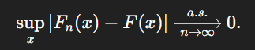

То есть ЭФР сходится к истинной функции распределения равномерно по всем $x$ (при большом $n$ график $F_n(x)$ практически повторяет график $F(x)$ целиком.

4. **Теорема Колмогорова**:

Пусть $X_{1} ,…,X_{n} $ — независимые одинаково распределённые случайные величины, их общая функция распределения $F$ **непрерывна**, а $F_n$ - выборочная функция распределения, построенная на первых $n$ элементах выборки. Тогда:

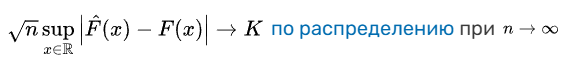

где $K$ - **распределение Колмогорова** с функцией распределения:

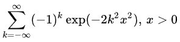

Теорема Колмогорова описывает **предельное распределение** максимального отклонения эмпирического распределения от истинного по всем $x$ при $n\to\infty$. При этом данная функция распределения для предельных отклонений не зависит от самой функции $F$. 

Эта теорема лежит в основе **критерия согласия Колмогорова–Смирнова**, который применяется для сравнения двух распределений или одной выборки с теоретическим распределением.
### Центральная предельная теорема


А также: 

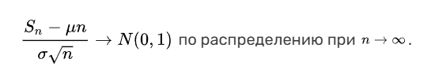

<br>
ЦПТ верна только при условиях, которые в ней указаны:
1. Анализируемая величина должна являться суммой случайных величин;
2. Случайные величины в сумме должны быть **независимы** и **одинаково распределены**.<br>
Теорема выполняется вне зависимости от того, как именно распределены эти случайные величины.

Ни при каком конечном n случайная величина $S_n$  не будет в точности распределена нормально. Тем не менее, центральная предельная теорема гарантирует, что с увеличением количества n случайных величин $X_i$ плотность распределения величины $S_n$  будет всё больше похожа на функцию плотности распределения $N(μ⋅n, σ^2⋅n)$.

<br>
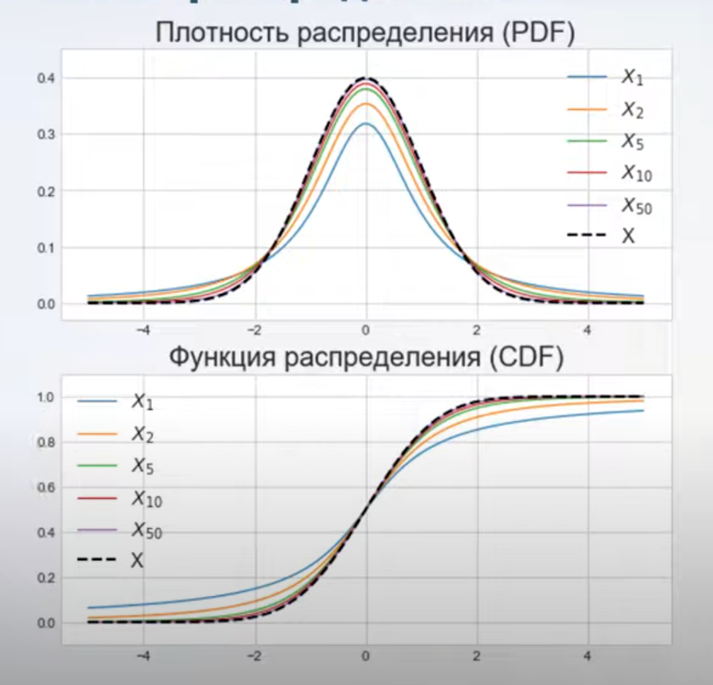

<br>


**ЦПТ для выборочного среднего:**

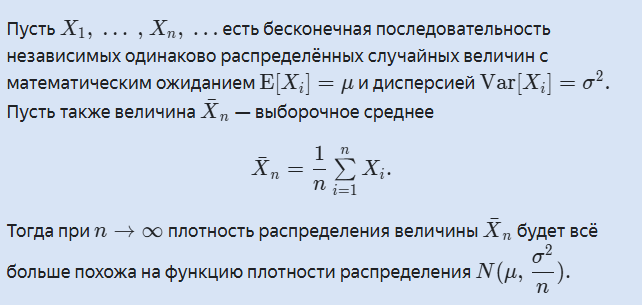<br>
Эта формулировка теоремы получается с помощью алгебраических преобразований предыдущей:<br>
<br>
<br>
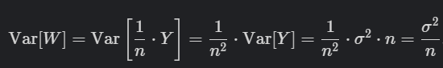

## Статистическая оценка параметров

### Точечные оценки

Один из способов проанализировать распределение имеющейся случайной величины и сделать о нем какие-то выводы - это **подобрать одно из известных нам распределений с конкретными параметрами, которое наилучшим образом будет описывать фактическое**.

Для этого нужно:
1. По описанию случайной величины предположить тип наиболее подходящего распределения: например, равномерное, геометрическое или какое-то другое.
2. Собрать выборку.
3. Оценить параметры этого распределения по выборке. 
4. Провести проверку.

Чем больше и более качественной будет выборка, тем более точным будет оценка, однако на практике зачастую собрать одновременно большую и репрезентативную выборку бывает сложно. В жизни часто используют объём выборки в 30 элементов. Обычно этого достаточно для сравнительно корректной оценки.


Выборка позволяет нам оценить параметры теоретического распределения с помощью статистик (числовых функций от выборки).<br>


*Например:*<br>
Мы работай со случайной величиной и предполагаем, что она имеет распределение Бернулли. Нам нужно узнать значение параметра $p$. Мы знаем, что для этого распределения:<br>
<br>
Следовательно, в качестве статистической оценки параметра $p$ можно использовать выборочное среднее:<br>
<br>
Предположим, что мы рассчитали выборочное среднее по выборке из 30 объектов и получили результат 0.1. Это число и будет оценкой параметра $p$. Получается, можно считать, что доля бракованных куриц описывается распределением Бернулли с вероятностью успеха 0.1. Этот результат можно использовать для дальнейших предсказаний.

Оценка параметра с помощью одного числа называется **точечной**.

Если для того, чтобы задать распределение, необходимо вычислить несколько параметров, можно сделать несколько статистических оценок. Например, чтобы задать нормальное распределение, необходимо не только выборочное среднее, но и выборочная дисперсия:<br>


<br>
Ключевое преимущество интервальной оценки в том, что она позволяет учесть неопределённость, связанную с оценкой.

Точечные оценки просто использовать, поэтому их применяют в случаях, когда нужна простота. Также они полезны, когда у нас есть большой объём данных и мы уверены в надёжности наших оценок.

Получить более полное понимание данных, учесть возможную неопределённость и оценить точность результатов помогают интервальные оценки. Они особенно полезны при работе с небольшими выборками данных или при проведении научных исследований, где важно учесть все возможные факторы.

### Смещённые и несмещённые оценки

Определить, как оценка параметра или характеристики стремится к истинному значению параметра или характеристики, поможет **смещение**:<br>

- Если смещение оценки равно нулю или стремится к нему, то среднее полученных оценок при увеличении выборки будет приближаться к истинному значению параметра.
- Если смещение не равно нулю и не стремится к нему, то среднее оценок не попадёт в точное значение параметра, как бы ни увеличивался размер выборки.<br>
Следовательно, прежде чем вычислять оценку, надо проверить её смещённость.

*Например:*
1. **Смещение не равно нулю:**<br>
Попробуем оценить математическое ожидание случайной величины $ξ$, распределённой равномерно с параметрами $a$, $b$ при помощи величины:<br>
<br>
Рассчитаем смещение:<br>
<br>
Оно не равно 0 и не стремится к 0, а значит, при увеличении выборки среднее значение полученных оценок будет отличаться от истинного значения параметра на 1.

2. **Смещение стремится к нулю:**<br>
Вычислим смещение оценки для точечной оценки дисперсии случайной величины $ξ$ по порождённой ею выборке $X=(x1, …, xn)$. Точечная оценка дисперсии равна:<br>
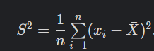<br>
Математическое ожидание выборочной дисперсии равно:<br>
<br>
Смещение оценки:<br>
<br>
Смещение будет уменьшаться с ростом размера выборки. А значит, при увеличении выборки оценка будет стремиться к истинному значению параметра.

Оценки со смещением, стремящимся к нулю, применяются **только для достаточно больших выборок**.

3. **Оценка несмещенная:**<br>


В частности, существует несмещенная версия оценки дисперсии:<br>
<br>
Чтобы получить такую оценку, взяли смещённую и умножили её на $\large \frac{n}{n-1}$.<br>
При маленьких значениях n такая оценка дает более точный результат:<br>
<br>
Аналогично с ковариацией:<br>
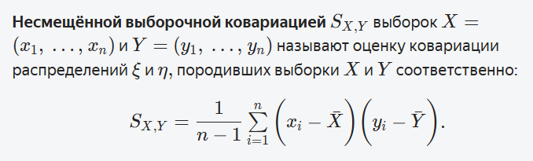


### Сравнение оценок

#### Эффективность оценки
Если у нас есть две **несмещённые оценки** и нужно выбрать из них одну, необходимо ввести понятие эффективности:<br>
<br>
У более эффективной оценки **меньше дисперсия**, а значит, **меньше диапазон её возможных значений**. Получается, если использовать более эффективную оценку, то мы с большей вероятностью попадём в маленькую окрестность истинного значения параметра.<br>


Кроме того, **чем меньше асимптотическая дисперсия** оценки, **тем меньший объем выборки требуется**, чтобы аппроксимировать при помощи этой оценки неизвестный параметр с наперед заданной точностью. 

<br>
Другими словами, наиболее эффективная оценка — это оценка с наименьшей дисперсией.

#### Функция риска
В ситуации, когда **смещение хотя бы одной оценки не равно, а стремится к нулю**, эффективность не подходит, потому что надо одновременно оценить две характеристики: 
* Качество стремления математического ожидания оценки к истинному значению;
* Малость дисперсии.

В таком случае, можно использовать функцию **риска** и функцию **потерь**.<br>
Функция **потерь** $L(\theta, a)$ ― штраф за разницу между истинным значением $\theta$ и принятым решением $\tilde{\theta}(x_{1}\dots x_{n})$.<br>
Функция **риска** $R(\tilde{\theta}, \theta)$ ― **средняя величина потерь** при оценивании $\theta$ с помощью $\tilde{\theta}$.

$$R(\tilde{\theta}, \theta)=E[L(X_{1}\dots X_{n})]$$

Так, если мы выбираем квадратичную функцию потерь, то можем использовать в качестве функции риска **MSE**:<br>


<br>
Получается, MSE оценки учитывает одновременно и приближение по математическому ожиданию, и малость дисперсии. Именно это нам и было нужно для сравнения смещённых оценок.

Для несмещённой оценки второе слагаемое в формуле обратится в ноль, и MSE станет равным дисперсии. Значит, несмещённая оценка с меньшим значением MSE будет оценкой с меньшей дисперсией, то есть более эффективной.

Получается, что вычисление среднеквадратичной ошибки — это универсальный подход к определению эффективности любой оценки.

Значение **MSE** само по себе ничего не показывает, оно используется только для сравнения двух разных оценок. Оценка, имеющая наименьшее MSE, будет лучшей для исследуемого параметра.

Заранее сделать вывод о точности оценки по её смещённости нельзя. Так:
- Для нормально распределённой случайной величины смещённая оценка выборочной дисперсии точнее несмещённой;
- Для равномерно распределённой случайной величины при размере выборки больше 6, наоборот, несмещённая оценка выборочной дисперсии лучше смещённой.

**Важное замечание.** Для расчёта MSE нужно знать точное значение параметра. В реальных задачах такого не бывает. Поэтому на практике поступают так:
1. сначала генерируют базу тестовых данных;
2. на них выбирают наилучшую оценку параметра;
3. затем эту оценку применяют к реальным данным.

**Сравнивать риски** между собой можно одним из подходов:
1. **Минмаксный** -  выбираем оценку, у которой при самом неблагоприятном значении $\theta$ риск меньше;
2. **Байесовский (интегральный)** - сравниваем площадь под графиком функций риска на всем множестве и выбираем оценку с наименьшей площадью;

#### Состоятельность оценки

<br>
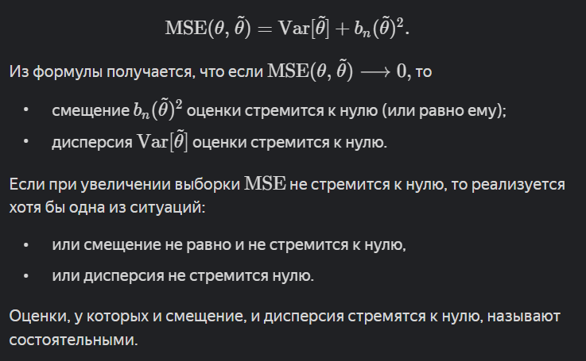<br>
Если оценка состоятельная, то можно быть уверенным: при выборке достаточно большого размера оценка будет близка к истинному значению параметра.

**Признак состоятельности оценки:**<br>


#### Асимптотическая нормальность
Пускай у нас снова есть какой-то **параметр** $\theta$ и наша **выборочная оценка** этого параметра $\tilde{\theta}_{n}$ по выборке размера $n$. Предположим также, что наши изначальные данные, для которых мы оцениваем этот параметр, имеют такую **плотность вероятности** $p(x)$, которая является **четной** и для которой выполняется условие $p(0)<>0$ (н-р: Гауссовское, Коши, Лапласа и др.). 

Тогда оценка $\tilde{\theta}_n$  называется **асимптотически нормальной**, если существует константа $\sigma^2 > 0$ такая, что


Или:

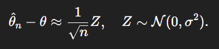

Или:

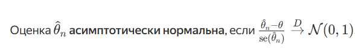

где $se(\tilde{\theta}_{n})$  - корень из дисперсии  $\tilde{\theta}_{n}$.

То есть при $n\rightarrow{\infty}$ распределение случайной величины $\tilde{\theta}_n$ становится почти нормальным со скоростью сходимости $\frac{1}{\sqrt{n}}$.

Проще говоря, асимптотическая нормальность означает, что если много раз брать выборки размера $n$ из одной и той же генеральной совокупности и в каждой считать оценку $\tilde{\theta}_{n}$  параметра $\theta$, то при достаточно большом $n$ **распределение этих оценок** будет приближаться к нормальному с математическим ожиданием $\theta$ и дисперсией порядка $\frac{1}{\sqrt{n}}$.

**Применение к математическому ожиданию:**

В случае с **математическим ожиданием** $\mu$ и выборочным средним $\overline{X}$ **асимптотическая нормальность** наглядно иллюстрируется при помощи **ЦПТ**: 


$$\sqrt{n}(\overline{X}-\mu)=\sqrt{n}(\frac{S_{n}}{n}-\frac{\mu n}{n})=\frac{S_{n}-\mu n}{\sqrt{n}}$$

Можем домножить числитель и знаменатель на $\sigma$:

$$\frac{S_{n}-\mu n}{\sqrt{n}}=\frac{S_{n}-\mu n}{\sigma\sqrt{n}}\sigma\rightarrow N(0,\sigma^2)$$

(*стремится по распределению*), где $\sigma^2$ - дисперсия любой из случайных величин, породивших выборку. 

Следовательно, согласно центральной предельной теореме **выборочное среднее** выборки $\overline{X}$ из распределения с конечными средним $\mu$ и дисперсией $\sigma^2$ является **асимптотически нормальной оценкой** параметра $\mu$.

**Применение к медиане:**

Определим **выборочную медиану** как $MED$. Если у нас есть упорядоченные по возрастанию элементы выборки $X_{1}\leq\dots\leq{X_{n}}$, тогда $MED$ равна $X_{k+1}$, если $n=2k+1$ или равна $\frac{X_{k}+X_{k+1}}{2}$, если $n=2k$. 

Определим также **теоретическую медиану** как $X_{\frac{1}{2}}$, которая является решением уравнение $F(x)=\frac{1}{2}$.

Тогда можно утверждать следующее:

$$\sqrt{n}\left( MED-X_{\frac{1}{2}} \right)\rightarrow N\left(0, \frac{1}{4p^2(0)} \right)$$

(*стремится по распределению*), где $p(x)$ - плотность распределения. 

Выбирая **между двумя асимптотически нормальными оценками**, нужно выбирать **более эффективную** - с меньшей асимптотической дисперсией. 

Так, в случае **нормального распределения**, асимптотическая **дисперсия медианы** в $\frac{\pi}{2}$ раз **больше** асимптотической **дисперсии выборочного среднего**, то есть оценка выборочным средним эффективнее.

В случае же **распределения Лапласа** наоборот - **дисперсия выборочного среднего** в 2 раза больше, чем **дисперсия выборочной медианы**, значит для него медиана более эффективна.


### Методы построения статистических оценок
#### Метод моментов
$k$-м (начальным) **моментом** случайной величины $X$ называется величина $E(X^{k})$. 

По **закону больших чисел**:<br>
$E(x)\xrightarrow{p}\overline{X},\ n\rightarrow{\infty}$<br>
$E(x^2)\xrightarrow{p}\overline{X^2},\ n\rightarrow{\infty}$<br>
$\dots$<br>
$E(x^k)\xrightarrow{p}\overline{X^k},\ n\rightarrow{\infty}$ 

Пусть случайная величина $X$ имеет распределение с параметрами $\theta = (\theta_1, \dots, \theta_k)$.<br>
**Метод моментов** заключается в том, чтобы взять формулу для теоретического момента через неизвестные параметры, приравнять её к соответствующему выборочному моменту и вывести эти параметры, решив систему.

$$
f_{k}(\theta_1, \dots, \theta_k)=E(\xi_{i}^k)
$$
$$
\begin{cases} 
f_{1}=\overline{X} \\
f_{2}=\overline{X^2} \\
\dots \\
f_{m}=\overline{X^m}
\end{cases}
$$

Из системы находим единственное решение уравнения $(\hat{\theta}_{n,1}, \dots, \hat{\theta}_{n,m})$.

**Пример для равномерного распределения:**<br>
Имеем случайную величину $\xi$, равномерно распределенную от 0 до неизвестного параметра $\theta$: $R(0,\theta)$.<br>
Мы знаем, что $E(\xi)=\frac{0+\theta}{2}=\frac{\theta}{2}=f_{1}(0,\theta)$.<br>
*Приравняем это к выборочному среднему:*<br>
$f_{1}=\frac{\theta}{2}=\overline{X}$<br>
*Следовательно:*<br>
$\hat{\theta}_{n}=2\overline{X}=\frac{2}{n}\sum_{1}^{n}{\xi_{i}}$

Допустим, у нас есть выборка размера $n$ вида $\{1,3,3,5,2,4\}$. Если мы предполагаем, что она порождена этой случайной величиной, мы можем оценить параметр $\theta$ так:<br>
$\overline{X}=\frac{18}{6}=3$<br>
$\frac{\theta}{2}=3$<br>
$\hat{\theta}_{n}=6$

**Пример для нормального распределения:**<br>
Имеем случайную величину $\xi$, нормально распределенную со следующими параметрами: $N(\theta_{1},\theta_{2}^2)$.<br>
*Мы знаем, что:*<br>
$E(\xi_{i})=\theta_{1}=f_{1}$<br>
$E(\xi^2)=\theta_{2}^2+\theta_{1}^2=f_{2}$ , *(следует из формулы дисперсии через матожидание)*<br>
*Составим систему:*

$$
\begin{cases} 
f_{1}=\theta_{1}=\overline{X} \\
f_{2}=\theta_{2}^2+\theta_{1}^2=\overline{X^2} \\
\end{cases}
$$

*Следовательно:*<br>
$\hat{\theta}_{n,1}=\overline{X}$<br>
$\hat{\theta}_{n,2}^2=\overline{X^2}-(\overline{X})^2$

#### Оценка максимального правдоподобия
Метод максимального правдоподобия использует информацию о распределении, чтобы построить оценки параметров.

**Функция правдоподобия:**


Если мы знаем, что случайная величина распределена непрерывно, можно заменить это выражение на произведение соответствующих плотностей вероятности:<br>
<br>
<br>
Эта функция имеет особенное название: **функция правдоподобия**.

Эта функция оценивает вероятность того, что элементы случайного вектора $\xi_{1},\xi_{2}\dots,\xi_{n}$ одновременно примут значения элементов набора $x_{1},x_{2}\dots,x_{n}$ . Если говорить нестрого, функция правдоподобия определяет, насколько вероятна реализация выборки $X$ при заданном $θ$.


*Например:*<br>
<br>


**Метод максимального правдоподобия для непрерывных величин:**

<br>
В функции правдоподобия можно зафиксировать выборку $X=(x_1 , …, x_n )$ и менять параметр $θ$:<br>
<br>
Значение такой функции - это вероятность наступления события $θ=\hat{θ}$ при условии уже реализованной выборки $X=(x_1, …, x_n)$.

Чтобы найти значение $θ$ с наибольшей вероятностью, нужно найти **максимум функции правдоподобия**. 

<br>
Тогда:<br>
<br>
Если функция правдоподобия $L(θ)$ дифференцируемая, то, чтобы найти её точки максимума, можно приравнять производные к нулю или использовать метод градиентного спуска.<br>


Получаем **алгоритм оценки параметров распределения**:
1. Предположить тип распределения исходной выборки.
2. Составить выражение функции правдоподобия для исходной выборки и выбранного распределения.
3. Найти значения оценок параметров, при которых функция правдоподобия достигает максимума. Это и будет оценка максимального правдоподобия.

*Например:*
1. **Экспоненциально распределенная величина:**<br>
<br>
<br>
<br>


2. **Равномерно распределенная величина:**<br>
<br>


3. **Нормально распределенная величина:**<br>
<br>
Когда вычисления сложные, исследование функции правдоподобия заменяют исследованием её логарифма. Логарифм произведения равен сумме логарифмов, поэтому вычисление производной произведения заменяется на вычисление производной суммы величин.

Натуральный логарифм — возрастающая функция, поэтому её применение к функции правдоподобия сохранит точки экстремума исходной функции и их тип.

<br>
<br>
Получается, для нормального распределения оценками максимального правдоподобия являются выборочное среднее и смещённая выборочная дисперсия.

<br>
Сравнив вероятности, полученные по разным распределениям, можно выбрать из них наибольшее.

**Метод максимального правдоподобия для дискретных величин:**

1. **Геометрически распределенная величина:**<br>
<br>
<br>


2. **Величина с распределением Пуассона:**

<br>
<br>


3. **Величина с биномиальным распределением:**<br>

#### Условия регулярности и информация Фишера
Пускай $f(x,\theta)$ - плотность или функция вероятности случайной величины $X$. 
Существует определенный набор требований, называемых **условиями регулярности**, выполнение которых позволяет получить дополнительную информацию о оценке $\hat{\theta}_{n}$ параметра $\theta$, полученной **методом максимального правдоподобия**:

*R1:* Область возможных значений $X$, где $f(x,\theta)>0$, не зависит от $\theta$
*R2:* $\frac{d}{d\theta}f(x,\theta)$ существует и конечна на всем множестве значений $X$, где  $f(x,\theta)>0$
*R3:* Множество значений $\theta$ - открытый интервал на прямой
*R4:* Если ввести функцию $U=\frac{d}{d\theta}\ln f(X,\theta)$, то для нее при всех $\theta$ справедливо тождество $E(U)=0$ (по факту означает, что мы можем менять местами производную и интеграл), а также $0<D(U)=I(\theta)<\infty$, где $I(\theta)$ - **Информация Фишера**.

Для понимания последнего условия введем определение **Информации Фишера**.
Будем рассматривать ту же функцию (*вклад выборки*) $U=\frac{d}{d\theta}\ln f(X,\theta)$ - производную по $d\theta$ логарифма функции правдоподобия случайной величины $X$. Тогда, в случае выполнения условия о том, что $E(U)=0$:

$$I_{1}(\theta)=D(U_{1})=E[(\frac{d}{d\theta}\ln f(X_{1},\theta))]^2$$

Эта запись для одного наблюдения может быть экстраполирована на выборку $X=(X_{1},X_{2}\dots X_{n})$:

$$I_{n}(\theta)=D(U_{n})=D(\sum_{i=1}^n{\frac{d}{d\theta}\ln f(X_{i},\theta)})=nI_{1}(\theta)$$

**Информация Фишера** - это мера того, сколько информации наблюдаемые данные содержат о неизвестном параметре модели. Она позволяет определить, **насколько распределение чувствительно к параметру** $\theta$ (если информация маленькая, значит данные мало рассказывают о параметре, а если большая, то наблюдения чувствительны к параметру и из них можно строить точные оценки).

Если *выполняются условия регулярности*, **информация Фишера** может также быть посчитана по формуле:

$$I(\theta) = - \mathbb{E}\bigg[\frac{\partial^2\ln{L}}{\theta^2}\bigg]$$
Смысл этой формулы в том, что информация тем больше, чем сильнее $\ln L$ меняется при изменении параметра $\theta$. Вторая производная логарифма как раз измеряет эту чувствительность. Соответственно, такую величину следует интерпретировать как **крутизну функции правдоподобия для одного наблюдения**. Большая информация - лог-правдоподобие **острое** - $\hat{\theta}_{n}$ находится близко к истинному $\theta$. Низкая информация - лог-правдоподобие **плоское** - оценка менее точная. 

Кроме того, если *выполняются условия регулярности*, а также $\hat{\theta}_{n}$ - некоторая несмещенная оценка параметра $\theta$, а выражение $E(\hat{\theta}_{n})$ можно дифференцировать под знаком интеграла, тогда выполняется **теорема Рао-Крамера**:

$$D(\hat{\theta}_{n})\geq {\frac{1}{I_{n}(\theta)}}$$

То есть, чем **больше информация Фишера**, тем **ниже возможная дисперсия** несмещённой оценки. Таким образом, данное неравенство задает нижнюю границу для дисперсии оценки неизвестного параметра. Оценка параметра называется **эффективной**, если для неё это неравенство обращается в равенство - дисперсия такой оценки будет наименьшей из возможных. 

Наконец, если *выполняются условия регулярности*, а также:
*R5:* $\frac{d^3}{d\theta^3}f(x,\theta)$ существует и конечна на всем множестве значений $X$, где $f(x,\theta)>0$
*R6:* Существует такая функция $h(x)$, что для всех значений $X$, где  $f(x,\theta)>0$, справедливо неравенство: $\frac{d^3}{d\theta^3}f(x,\theta)\leq h(x)$ и $E(h(x))<\infty$ 

Тогда оценка $\hat{\theta}_{n}$, полученная методом максимального правдоподобия через решение уравнения $\frac{d\ln{L}}{d\theta}=0$, будет не просто обладать обычными свойствами ММП-оценки, а будет также **асимптотически нормальной** с **асимптотической дисперсией** равной $\frac{1}{I_{1(\theta)}}$, то есть эта оценка будет **асимптотически эффективной**. 
 
### Бутстреп

Ранее упоминалось, что **эмпирическая функция распределения** - это:<br>
<br>
<br>
<br>
Эмпирическая функция распределения позволяет приближённо восстановить искомую функцию распределения. И, чем больше nn, тем точнее это приближение.

Это приводит нас к идее **Бутстрепа**. Это способов оценивания выборочного распределения статистической величины или модельных параметров через извлечение дополнительных выборки с возвратом из самой выборки и перевычисления статистику или модели для каждой повторной выборки. 

Допустим, мы хотим построить новую выборку размера m. В таком случае нужно m раз случайным образом выбрать элемент исходной выборки $x_1, …, x_n$. Выбранный элемент остаётся в наборе, то есть каждый раз мы случайно выбираем один элемент из исходного набора из n элементов. Так бутстреп помогает получить много выборок исходной случайной величины.

Исходная выборка содержит информацию о случайной величине, которая её породила. Мы создаём новые выборки на основе исходной и ожидаем, что они тоже хранят информацию об этой случайной величине.

**Алгоритм** бутстраповского повторного отбора среднего значения для выборки размера n будет следующим: 
1. Извлечь выборочное значение, записать его и вернуть назад. 
2. Повторить n раз. 
3. Записать среднее для n повторно отобранных значений. 
4. Повторить R раз шаги 1-3. 
5. Использовать R результатов, чтобы: 
	* Вычислить их стандартное отклонение (оно оценивает стандартную ошибку выборочного среднего);
	* Построить гистограмму или коробчатую диаграмму; 
	* Найти доверительный интервал.

<br>


**Использование для построения доверительного интервала:**<br>
Если исходный набор данных большой, то сработает центральная предельная теорема, значит, среднее значение параметра будет распределено нормально. В таком случае его доверительный интервал вычисляют по формуле:<br>
<br>


**Вариант для несимметричного распределения бутстрапированной величины:**<br>
В некоторых случаях, когда распределение исходной величины далеко от нормального или если исходная выборка была мала, распределение бутстрапированного параметра может получиться несимметричным:<br>
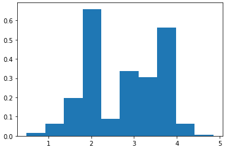<br>
<br>
*Например:*<br>
<br>


## Интервальная оценка параметров

### Идея интервальной оценки

Согласное центральной предельной теореме, многократно извлекая выборки из ГС и подсчитывая в них среднее, можно получить распределение средних, близкое к нормальному. Среднее всех средних при этом будет близко к среднему ГС.<br>
<br>
При $n→∞$ функция плотности распределения случайной величины $\overline{X}_n$  будет всё больше похожа на функцию плотности нормального распределения с параметрами $N\left(\mu_X, \frac{\sigma_X^2}{n}\right)$.

X — случайная величина, описывающая распределение ГС;<br>
$\overline{X}_n$   — случайная величина, отражающая распределение среднего значения по выборке размера n;<br>
Тогда:<br>
<br>
<br>
Последнее значение (стандартное отклонение распределения выборочных средних) также называют **стандартной ошибкой**.<br>
Она показывает, какова ожидаемая величина отклонения средних значений выборок от истинного среднего значения генеральной совокупности при заданном размере выборки n и стандартном отклонении величины $σ_X$.<br>


Распределение выборочных средних можно стандартизировать, как и любое нормальное распределение:<br>


Кроме того, для этого распределения (как и для прочих) можно считать **квантили**:<br>
<br>
**Квантиль уровня α** — это значение $k_α$, которое делит распределение на две части. Квантиль устанавливает границу так, что доля значений, которые меньше или равны $k_α$ , составляет α, а доля значений, которые больше или равны $k_α$ , составляет $1−α$.<br>
**Математически это выражается так:**<br>


**Критические значения:**

Предположим, мы хотим найти интервал $(a, b)$, в котором с заданной вероятностью будет находиться случайная величина $Z$. Мы можем определить две границы так, чтобы:<br>
<br>


*Например:*<br>
Пусть нам нужно найти интервал, в который с вероятностью 95% попадёт случайная величина Z.<br>
Тогда вероятность того, что случайная величина не попадёт в этот интервал, равна 5%. Стандартное нормальное распределение симметрично относительно нуля, поэтому можно отсечь одинаковые «хвостики» справа и слева — каждый по 2.5%. Получим отрезок:<br>
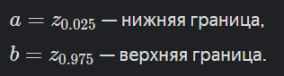<br>
В таком случае вероятность того, что случайная величина Z будет находиться между a и b:<br>


Эти квантили ещё называют **критическими значениями**. Они как бы обрамляют центральную часть распределения и помогают определить «наиболее вероятный» диапазон значений случайной величины.

Параметр α называют **уровнем значимости**.<br>
Вероятность 1−α иногда называют **уровнем доверия**.

**Доверительный интервал:**

<br>
Допустим, мы знаем параметры распределения случайной величины X и проводим бесконечно много экспериментов. В каждом эксперименте мы:<br>
<br>
*Например:*<br>


Если мы будет проводить серию экспериментов:<br>
<br>
И при этом зафиксируем известные значения математического ожидания и необходимый уровень значимости α = 0.05, то приблизительно в 95% случаев интервал, построенный вокруг среднего по выборке, накрывает математическое ожидание случайной величины. Значит, количество ошибок примерно соответствует уровню значимости α.

<br>
<br>
Это правильная формулировка. Границы доверительного интервала связаны со случайной величиной, они меняются от выборки к выборке. Вероятность связана именно с надёжностью оценки границ интервала.

**Доверительный интервал в общем виде:**<br>


### Распределение Стьюдента

Теперь будем рассматривать случаи, когда нам изначально неизвестно СКО генеральной совокупности, и нужно обходиться без него.

Известно, что лучшая несмещённая оценка для стандартного отклонения в рамках выборки — выборочное стандартное отклонение $S_n$:<br>
<br>
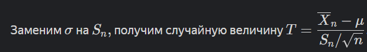<br>
Если выборочные средние распределены нормально, то случайная величина T будет иметь особенное распределение. Его называют **распределением Стьюдента** или **t-распределением**.

**Степени свободы:**

Степени свободы описывают количество значений в наборе данных, которые могут варьироваться, когда известны некоторые статистические параметры выборки.

В контексте выборочного стандартного отклонения это означает, что если известно среднее значение выборки, то из $n$ наблюдений только $n−1$ могут свободно варьироваться. Последнее значение строго определяется выбранными $n−1$ значениями и средним.<br>
Это ограничение и является причиной, по которой степень свободы для выборочного стандартного отклонения составляет $n−1$.<br>
<br>


График распределения Стьюдента напоминает график нормального распределения, но его форма зависит от количества степеней свободы:<br>
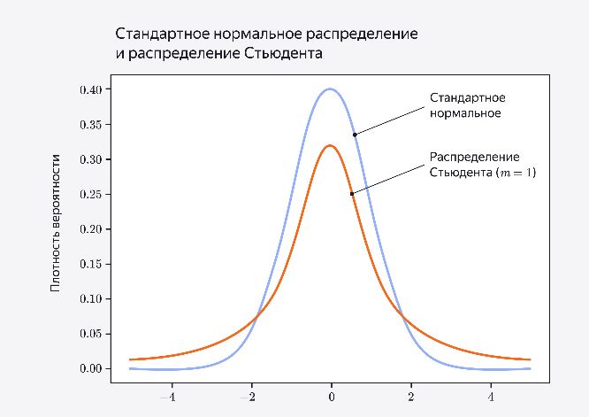<br>


С увеличением размера выборки распределение Стьюдента сужается и его хвосты «облегчаются». График становится всё более похожим на нормальное распределение. Видно, что графики распределений явно отличаются только при n, меньших 30, а при большем количестве наблюдений они почти совпадают.

<br>


**Критические значения:**<br>
<br>
У t появился дополнительный индекс, который показывает степени свободы.

**Доверительные интервалы:**<br>
<br>
<br>


**Односторонний доверительный интервал:**<br>
Для двустороннего доверительного интервала формула такая:<br>
<br>
Когда нужен односторонний интервал, α делить не нужно — вся неопределённость остаётся с одной стороны:<br>
<br>
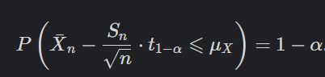<br>
<br>
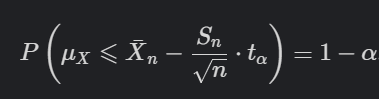<br>

### Логнормальное распределение
<br>
В этой записи **LogN** — название распределения, а не операция логарифмирования.<br>
<br>
На графике максимум соответствует наиболее вероятному значению. Крутой спуск слева от максимума описывает резкое уменьшение вероятности получить меньшее значение. Длинный пологий «хвост» справа от максимума визуализирует вероятность того, что значение окажется больше ожидаемого.

Такое распределение хорошо описывает процессы, когда:
- **Задано пороговое значение величины**. Обычно есть план действий, чтобы его достичь, поэтому вероятность именно этого значения максимальна.
- **Отклонение в меньшую сторону очень нежелательно**. Чем сильнее отклонение, тем меньше его вероятность.
- **Превышение порога требует сложных действий**, поэтому эта ситуация менее вероятна, чем достижение порогового значения. Но **эта ситуация желанна**, поэтому вероятность отклонения от порогового значения в большую сторону падает медленнее, чем отклонение в меньшую сторону.

**Это распределение связано с нормальным:**<br>
Если величина $X∼LogN(μ, σ^22)$, то величина $Y=ln(X)$ распределена $Y∼N(μ, σ^22)$.

То есть, если случайная величина имеет логнормальное распределение, то её логарифм имеет нормальное распределение.

В обратную сторону это тоже работает: если $X∼N(μ, σ^22)$, то величина $Y=exp(X)$ распределена $Y∼LogN(μ, σ^22)$.

<br>
Log-преобразование помогает в случаях, когда исходное распределение сильнее «скошено» влево. Он может сделать данные более похожими на нормально распределённые.

*Например:*<br>
До логарифмизации:<br>
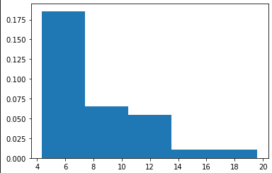<br>
После логарифмизации:<br>

## Статистическая проверка гипотез

### Общий подход к проверке гипотез

Чтобы проверить любые предположения математически, сначала нужно переформулировать их в чёткие проверяемые утверждения — гипотезы.

Всегда формулируются две гипотезы:
- **Нулевая гипотеза,** обозначается H0;
- **Альтернативная гипотеза,** обозначается H1;

**Нулевая гипотеза** формулируется как **утверждение, которое необходимо проверить**. Чаще всего в качестве нулевой гипотезы формулируют утверждение про отсутствие связи, отсутствие отличий, отсутствие какого-то явления. 

**Альтернативная гипотеза** обычно соответствует предположению, что связь, отличия или какое-то явление — есть.

Нулевая гипотеза считается истиной «по умолчанию», то есть до тех пор, пока данные не предоставят убедительных доказательств против неё.<br>
<br>


Чтобы определить, верна ли нулевая гипотеза, нужно проанализировать выборку. Обычно выбирают одно число — статистику выборки $f(X1, …Xn)$, и значения этой статистики сравнивают с некоторым числом. На основе этого сравнения делают вывод по гипотезам.<br>
<br>


<br>


<br>
<br>


**Ошибки первого и второго рода:**<br>
<br>
**Ошибка первого рода** (𝛼-ошибка, ложноположительное заключение) — ситуация, когда отвергнута верная нулевая гипотеза (об отсутствии связи между явлениями или искомого эффекта).<br>
Вероятность ошибки **первого рода** при проверке статистических гипотез называют **уровнем значимости** ($α$).

**Ошибка второго рода** (β-ошибка, ложноотрицательное заключение) — ситуация, когда принята неверная нулевая гипотеза.<br>
Вероятность ошибки второго рода обозначается как $β$. C этой величиной тесно связана другая, имеющая большое статистическое значение — **мощность критерия**. Она вычисляется по формуле $(1−β)$. Чем выше мощность критерия, тем меньше вероятность совершить ошибку второго рода.<br>
<br>
Высокая мощность снижает вероятность совершить ошибку второго рода, но повышает риск совершить ошибку первого рода - отклонить верную нулевую гипотезу.

**MDE и размер выборки:**<br>
Если заранее не определиться с рамками A/B теста и требуемым количеством наблюдений, можно столкнуться с **проблемой подглядывания**, то есть принять решение на основании промежуточных результатов, пока p-value еще не устаканилось.

Чтобы избежать этого, нужно заранее установить требуемый **размер выборки**.<br>
Для этого нужно зафиксировать:
* **MDE**<br>
<br>
*Например:* важно, чтобы новая версия сайта увеличивала средний чек минимум на 10 рублей.
* **Критическое значение** ($\alpha$)
* **Мощность** ($1-\beta$)

Если мы рассматриваем случай с двумя выборками, зависимость между этими показателями будет выглядеть так:<br>
<br>
Тогда найти необходимый размер выборки можно по формуле:<br>
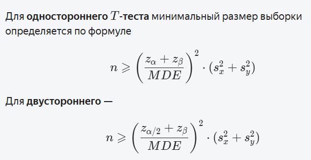<br>
В случае с Z-тестом выборочные дисперсии просто заменяются на дисперсии распределений генеральных совокупностей.

**Алгоритм проверки гипотезы:**<br>


**Непараметрические и параметрические тесты:**<br>
**Параметрические** тесты основаны на предположениях о параметрах генеральной совокупности и распределениях, из которых берутся данные:
- **Нормальность**. Данные должны быть нормально распределены или иметь достаточный размер, чтобы использовать ЦПТ.
- **Независимость**. Данные должны быть реализацией случайной выборки.
- **Отсутствие выбросов**. В данных не должно быть сильно больших или малых значений по сравнению с другими значениями выборки.
- **Равенство дисперсий**. В большинстве тестов предполагают, что дисперсии анализируемых выборок примерно равны.

Существует и другой тип тестов — **непараметрические**. Они ничего не предполагают о параметрах генеральной совокупности. Эти тесты используют, если параметрические условия для тестирования параметров распределения не соблюдаются.<br>
Непараметрические тесты имеют меньше ограничений, но зачастую имеют **меньшую статистическую мощность**, чем параметрические, а также их **результаты сложнее интерпретировать**.


**Множественная проверка гипотез:**<br>
<br>
Названный эффект заключается в том, что вероятность допустить ошибку первого рода резко возрастает при одновременной проверке большого числа гипотез.

*Например:*<br>
Проводим 5 статистических тестов с $\alpha=0.05$. Тогда вероятность показать незначимость во всех пяти случаях, при условии, что ее действительно нет, равна:<br>
$p=0.95^5=0.77$. То есть с вероятностью 0.23 будет допущена случайная ошибка первого рода.

<br>
Где V - количество ошибок первого рода в n экспериментах.

Логично было бы контролировать эту величину на заранее заданном уровне $α$:<br>
<br>
Для этого существует несколько способов:<br>
<br>
<br>


### Тесты для среднего

**Выборочное среднее и гипотетическое среднее ГС:**

Предположим, есть выборка $X1, X2, …, X_n$  из некоторого распределения. Математическое ожидание этого распределения неизвестно, но у нас есть предположение относительно того, чему оно может быть равно.

При проведении теста мы можем рассматривать одну из трех задач:
* **Двухсторонний** тест (выборочное среднее != среднему ГС)
* **Односторонний** тест (выборочное среднее **<** среднего ГС)
* **Односторонний** тест (выборочное среднее **>** среднего ГС)

То, какой вид примет статистика критерия, зависит от того, известна ли в задаче **дисперсия** **генеральной совокупности**:<br>
<br>
<br>
где $S$ — выборочное стандартное отклонение несмещённой дисперсии,<br>
$\sigma$ - стандартное отклонение ГС.

**Z-тест для среднего одной выборки:**<br>
Рассмотрим задачу. Есть выборка $X1, X2, …, X_n$  из интересующего нас распределения. Пусть $μ=E[X_i]$ — неизвестный параметр, а $σ^2=Var[Xi]$ — известный.

Опишем работу теста в двустороннем варианте:<br>
<br>
Естественно предположить, что если $H_0$ верна, то $\overline{X}$ близок к $μ_0$.<br>
Тогда статистика для этого теста будет близка к 0:<br>
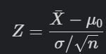<br>
Определим критическую область как $K=(−∞, −c]∪[c, +∞)$. Здесь $c$ и $−c$ — это критические значения, определяемые на основе уровня значимости $α$.<br>
Критические значения определяются так, что:<br>
<br>
У Z-теста есть одно бесспорное преимущество: мы знаем распределение Z и, следовательно, можем легко определить критические значения для нашего критерия:<br>
<br>
Так как распределение $N(0, 1)$ симметрично вокруг нуля, то:<br>
<br>
Зафиксируем уровень значимости $\alpha=0.05$.<br>
Тогда:<br>
$\large P(Z⩾c ∣ H_0 )=α/2 =0.05 /2=0.025$<br>
Отсюда можно найти критическое значение:<br>
$\large c=Z_{0.025}≈1.96$<br>
Далее мы можем рассчитать выборочное Z-значение и сравнить его с критическими.<br>


**T-тест для среднего одной выборки:**<br>
<br>
Теперь вместо неизвестной дисперсии мы используем выборочную дисперсию $S^2,$ а вместо квантилей стандартного нормального распределения — квантили распределения Стьюдента $t_{n−1, α/2}$ .<br>
<br>
p-значение равно:<br>
$P(∣T∣⩾t_{выб})=P(T⩾t_{выб})+P(T⩽−t_{выб})$.

**Z-тест для среднего двух выборок:**

Применяется при условии, что нам известны дисперсии ГС обеих выборок.<br>
<br>
При расчёте статистики для Z-теста применяют известные дисперсии. Когда тест проводят для двух выборок — учитывают две дисперсии, и в этом отличие от одновыборочного теста.<br>


**T-тест для среднего двух выборок с равными дисперсиями:**

<br>
Когда дисперсии распределений генеральных совокупностей для выборок неизвестны, учитывают две выборочные дисперсии в статистике:<br>


**T-тест для среднего двух выборок с отличными дисперсиями:**

<br>


**Т-тест для среднего двух выборок с логнормальным распределением и равными дисперсиями:**

Log-преобразование часто используют, чтобы проверить, равны ли математические ожидания двух совершенно не нормальных выборок.

Пусть у нас есть две выборки, порождённые независимыми случайными величинами X и Y, обладающие равными дисперсиями, а значит равными параметрами σ. Пусть эти величины распределены по логнормальному закону, но с разными параметрами:<br>
<br>
**H-0:** Средние значения выборок равны.<br>
**H-1:** Средние значения выборок значимо отличаются.

Выборка маленькая, исходные распределения не нормальные, поэтому использовать T-тест нельзя. Применим к исходной выборке Log-преобразование:<br>
<br>
Теперь предположим, что преобразованные выборки порождены нормальным распределением. Тогда для новых выборок можно применить T-тест и по его результатам сделать вывод, равны ли математические ожидания исходных выборок.

**U-тест Манна-Уитни для медианы для двух двух небольших независимых выборок с неизвестным распределением или с выбросами:**


<br>
Или:<br>


Для теста Манна — Уитни статистика критерия обозначается как U и определяется как минимальное из значений $U_1$  и $U_2 $:<br>
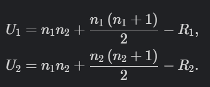<br>
Где $n_1, n_2$  — количество значений в каждой из выборок,<br>
$R_1, R_2$ — ранги выборок (то есть сумма порядковых номеров каждого значения из выборки в отсортированной объединенной выборке).<br>
*Например:*<br>
<br>
<br>
<br>
<br>
<br>
<br>
Где $U_{\alpha}(n_1,n_2)$ - табличное значение.

**T-тест Вилкоксона для медианы двух парных измерений по уровню какого-либо количественного признака:**

Предназначен для сравнения двух зависимых выборок между собой по уровню выраженности какого-либо признака.

С его помощью можно определить:
1) Направленность изменений
2) Выраженность изменений в зависимых выборках.

<br>
<br>
Где $T_{\alpha}(n_1,n_2)$ - табличное значение.

*Например:*<br>
<br>
<br>
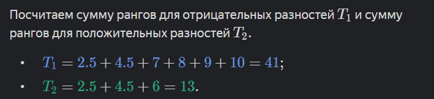<br>
Статистика критерия T — это минимальное из двух значений.

## Метод главных компонент

### Содержание метода

Суть метода главных компонент — оценить, какие признаки в данных часто встречаются вместе, а какие редко, и дальше использовать эту информацию для более компактного кодирования.

Допустим, у нас есть двухмерный массив данных. Изобразим его на графике:<br>
<br>
Для этого набора точек можно построить матрицу ковариации:<br>
<br>
Элементы матрицы определяются как ковариации между соответствующими массивами данных:<br>
<br>
<br>


Любую двумерную матрицу можно изобразить с помощью эллипса на плоскости. Центр эллипса будет в начале координат, а положения осей будут зависеть от собственных векторов. Построим на одной плоскости эллипс, соответствующий матрице ковариации, и множество точек, по которому мы построили эту матрицу:<br>
<br>
Далее сдвинем все точки на вектор $(−\overline{x}, −\overline{y})$. При сдвиге на вектор $(−\overline{x}, −\overline{y})$ значения дисперсий и ковариаций не меняются. Следовательно, матрица ковариации тоже остаётся неизменной. А это значит, что матрицы ковариаций совпадают у исходного массива точек и у сдвинутого на $(−\overline{x}, −\overline{y})$ массива:<br>
<br>
Выходит, что матрица ковариации отличается тем, что соответствующий ей эллипс показывает, в каких направлениях данные распределены сильнее всего.

Аналогичный прием работает с данными большей размерности:<br>
<br>
Для визуализации таких матриц ковариации хорошо подходят тепловые карты:<br>


### Применение для уменьшения размерности данных

Если у нас есть данных большой размерности, их может быть трудно визуализировать. Для этого иногда имеет смысл перейти к меньшей размерности, например, к двух и трехмерной. 

Одни из способ сделать это является объединение нескольких признаков в один. Рассмотрим случай с двумя признаками, которые мы хотим сжать в один:<br>
<br>
Мы хотим спроецировать наши данные на новые направления — такие, в которых данные распределены сильнее всего. Эти направления задаются собственными векторами матрицы ковариации.

Нам нужно рассчитать матрицу ковариации, найти для нее собственные векторы, а затем центрировать все точки (сдвинуть их на $(−\overline{x}, −\overline{y})$). В результате, получаем такую картину:<br>
<br>
Поскольку ковариационная матрица является симметричной, мы получили два ортогональных вектора, из которых можем выбрать единичные - **главные компоненты**. Мы можем спроецировать наши точки на одну из осей:<br>
<br>
Чтобы выбрать, на какую из осей проецировать точки, нужно рассмотреть собственные значения:<br>
<br>
То есть собственные значения описывают дисперсию данных вдоль осей, которые построены специально для исходных точек. Нам нужно выбрать ту главную компоненту, собственное значение для которой **больше**, поскольку большая дисперсия означает **большую информативность**.

**Применение в общем случае:**

В случае большего числа размерностей порядок действий тот же: определяют собственные векторы матрицы ковариации и проецируют исходный набор данных на полученные оси.

Для этого мы умножаем центрированную матрицу признаков на матрицу собственных векторов:<br>
    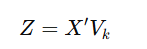  

Идея в таком случае сохраняется — данные сильнее разбросаны вдоль осей с наибольшими собственными значениями своих векторов. Поэтому далее оставляют наиболее информативные направления и отбрасывают размерности, которые содержат мало информации.

Особенность метода состоит в том, что он помещает максимум имеющейся информации в первую главную компоненту, максимум оставшейся — во вторую, максимум, который останется после, — в третью и так далее. Чем больше порядковый номер компоненты, тем меньше информации об исходных данных в ней содержится. Поэтому мы и выбираем векторы, которые соответствуют наибольшим собственным значениям.<br>
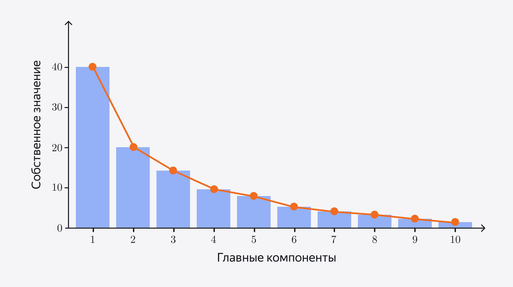

**Алгоритм применения:**
* **Шаг 1.** Вычесть среднее значение каждой переменной построчно.
* **Шаг 2.** Вычислить матрицу ковариации.
* **Шаг 3.** Вычислить собственные значения и векторы.
* **Шаг 4.** Отсортировать собственные значения в порядке убывания.
* **Шаг 5.** Выбрать первые p главных компонент.
* **Шаг 6.** Получить новый датасет.

**Поиск главных компонент при помощи SVD:**<br>
Доказано, что матрицу ковариации можно вычислить по такой формуле:<br>
<br>
Из этого происходит альтернативный метод определения главных компонент с помощью SVD:<br>


### Применение PCA для анализа данных

**Выделение групп данных:**

Используя PCA, мы можем уменьшить размерность исходного набора данных и визуализировать имеющиеся в данных группы.

*Например:*<br>
Возьмем датасет с 3 сортами вин и 13 признаками.<br>
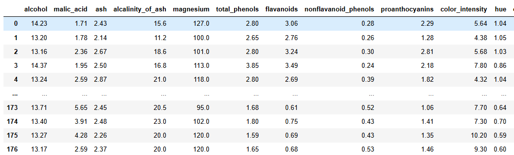<br>


Проведем **нормализацию данных**. Это необходимо, потому что столбцы, в которых значения величин большие, забирают на себя всё «внимание» PCA. Влияние столбцов, в которых значения меньше, становится малым.<br>
<br>
Как правило, дисперсию всех столбцов приводят к 1. Для этого каждый столбец делят на квадратный корень из выборочной дисперсии, то есть на стандартное отклонение. 

Далее сожмем нормализованную матрицу признаков до двух столбцов при помощи PCA и визуализируем ее с прокраской по сортам:<br>
<br>
Классы, соответствующие разным сортам вин, практически не пересекаются.<br>
Видно, что, даже если точки не раскрашивать, выделить три отдельные группы теперь проще:<br>


**Улучшение качества линейной регрессии:**

Когда признаков много, линейная регрессия работает не очень хорошо. Один из способов улучшения модели — отбросить лишнюю информацию и построить регрессию только на значимых данных. Чтобы справиться с этой проблемой, можно использовать регуляризацию, а можно применить PCA.

*Например:*<br>
Возьмем датасет с данными о прогрессии диабета у пациентов. С помощью датасета прогнозируют переменную `y` — численную оценку прогрессии болезни после контрольного замера через год.<br>


Если построить обычную линейную регрессию по этим данным, получим приблизительно такой результат:<br>
<br>
Чтобы улучшить результат можно использовать следующий алгоритм:
1) Разбить выборку на две части: обучающую `X_train` и тестовую `X_test`;
2) В обучающей выборке выделить главные компоненты с помощью PCA;
3) Построить линейную регрессию по главным компонентам;
4) Вычислить ошибку модели на тестовой выборке.

Так, в данном примере, при использовании 4 главных компонент есть возможность несколько снизить ошибку:<br>


Количество столбцов, на которых будет обучаться линейная регрессия, — это параметр обучения. Количество главных компонент выбирают разными способами. Если датасет не очень большой, то часто перебирают значения параметра: строят регрессию для разного количества главных компонент и оценивают качество полученных моделей. Выбирают такое количество компонент, при котором ошибка модели наименьшая. Если же возможности перебрать все значения нет, то анализируют сингулярные значения исходной матрицы данных: определяют количество маленьких значений и по нему решают, сколько столбцов отбросить.

