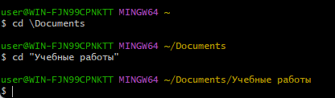

# Linux

# Командные оболочки

Командная оболочка или командный интерпретатор - это приложение предоставляющее пользователю интерфейс командной строки в которой тот либо вводит команды по отдельности, либо запускает скрипты состоящие из списка команд. Устно и в неофициальных текстах часто называется «шел», от английского shell — оболочка.

Примеры: bash, zsh, fish и другие.

Они похожи по смыслу, но могут отличаться по дополнительному функционалу.

## Командная строка (базовые команды)

Здесь всегда отображается имя пользователя (user) и имя компьютера (WIN-FJN99CPNKTT)

$ означает, что командная строка ждем ввода пользовательской команды

Чтобы узнать, в какой директории сейчас находится пользователь, нужно ввести команду:

```bash
# print working directory
$ pwd
/c/Users/user
```

По умолчанию пользователь оказывается в домашней директории. Она обозначается как ~

Чтобы отобразить содержимое директории, используется команда:

```bash
#  list directory contents
$ ls
```

Если добавить к ls флаг -a будут также показаны скрытые файлы

Чтобы сменить директорию, используется команда:

```bash
# change directory
$ cd name
```

## Про cd

Если в названии директории есть пробелы, нужно использовать кавычки:



Можно также перейти сразу через несколько директорий, используя слеши:


Если вместо имени директории указать две точки, можно вернутся на уровень выше:


Одна точка после cd обращается к текущей директории

Чтобы переместиться в корневую директорию, нужно использовать:


Чтобы создать новый файл используется команда:

```bash
# touch
$ touch name
```

Чтобы создать новую директорию, используется команда:

```bash
# make directory
$ mkdir name
```

Таким образом, можно сразу создать целую структуру директорий, используя флаг -p


Чтобы скопировать файл из одной директории в другую, используется команда:

```bash
# copy
$ cp file_name dir_name
```


Можно перечислить сразу несколько файлов через пробел

Чтобы переместить файл из одной директории в другую, используется команда:

```bash
# move
$ mv file_name dir_name
```


Чтобы распечатать содержимое текстового файла в консоль, используется команда:

```bash
# concatenate and print 
$ cat file
```


Cat используется также для объединения содержимого двух файлов:


Если ввести команду cat без параметра, она будет слушать стандартный поток ввода и отправлять полученные входные данные на дисплей терминала в качестве стандартного вывода и останавливается после того как получает EOF (CTRL+D). Если перенаправить поток вывода в файл, данные будут записываться туда.

Чтобы удалить файл, используется команда:

```bash
# remove
$ rm file
```


Чтобы удалить все файлы из директории и ее саму, используется та же команда с флагом -r


Пустую директорию можно удалить командой rmdir

Чтобы вывести в консоль что-то, что передается в качестве параметра, используется команда:

```bash
# echo
$ echo "сообщение"
```

Если слегка модифицировать эту команду, то можно использовать ее для записи новых строк в конец файла:

```bash
# echo
$ echo "текст" >> file
```

Важно! Если вместо >> написать > все содержимое файла перезапишется на новое сообщение.

Чтобы осуществлять поиска текста по заданному шаблону внутри файлов или вывода других команд, используется команда grep:

```bash
$ grep "<паттерн>" file
```


- -c: вывести только количество строк, соответствующих шаблону.
- -l: вывести только имена файлов, содержащих шаблон.
- -w: искать только целые слова.
- -o: вывести только те части строк, которые совпадают с шаблоном.
- -i: отключает учет регистра.
- -v: вывести строки, не содержащие шаблон.
- -E: использовать регулярное выражение.

Через перенаправление стандартного потока вывода grep можно передавать результат работы других команд:


### Лайфхаки:

1. Вызывать сразу несколько команд, разделяя из знаком &&:


1. Перемещаться по ранее вызванным командам, используя стрелки  (`↑`) и (`↓`)
2. Использовать TAB, чтобы получать подсказки для команд и путей:


1. Остановить запущенный процесс:

CTRL + C, CTRL + D или CTRL + Z (пауза)

### Шпаргалка

### Навигация

- `pwd` (от англ. print working directory, «показать рабочую папку») — покажи, в какой я папке;
- `ls` (от англ. list directory contents, «отобразить содержимое директории») — покажи файлы и папки в текущей папке;
- `ls -a` — покажи также скрытые файлы и папки, названия которых начинаются с символа `.`;
- `cd first-project` (от англ. change directory, «сменить директорию») — перейди в папку `first-project`;
- `cd first-project/html` — перейди в папку `html`, которая находится в папке `first-project`;
- `cd ..` — перейди на уровень выше, в родительскую папку;
- `cd ~` — перейди в домашнюю директорию (`/Users/Username`);
- `cd /` — перейди в корневую директорию.

### Работа с файлами и папками

Создание

- `touch index.html` (англ. touch, «коснуться») — создай файл `index.html` в текущей папке;
- `touch index.html style.css script.js` — если нужно создать сразу несколько файлов, можно напечатать их имена в одну строку через пробел;
- `mkdir second-project` (от англ. make directory, «создать директорию») — создай папку с именем `second-project` в текущей папке.

Копирование и перемещение

- `cp file.txt ~/my-dir` (от англ. copy, «копировать») — скопируй файл в другое место;
- `mv file.txt ~/my-dir` (от англ. move, «переместить») — перемести файл или папку в другое место.

Чтение

- `cat file.txt` (от англ. concatenate and print, «объединить и распечатать») — распечатай содержимое текстового файла `file.txt`.

Удаление

- `rm about.html` (от англ. remove, «удалить») — удали файл `about.html`;
- `rmdir images` (от англ. remove directory, «удалить директорию») — удали папку `images`;
- `rm -r second-project` (от англ. remove, «удалить» + recursive, «рекурсивный») — удали папку `second-project` и всё, что она содержит.

## Man

Man - система просмотра системных руководств по командам.

Может быть вызван прямо в командной строке:

```bash
$ man <нужная сущность>
```


## Управление выводом

Стандартный вывод и стандартная ошибка отображаются на дисплее терминала пользователя в виде текста.

Ввод и вывод распределяется между тремя стандартными потоками:

- stdin (0) — стандартный ввод (клавиатура)
- stdout (1) — стандартный вывод (экран)
- stderr (2) — стандартная ошибка (вывод ошибок на экран)

Потоки можно подключать к чему угодно: к файлам, программам и даже устройствам. В командном интерпретаторе bash такая операция называется перенаправлением:

- < file — использовать файл как источник данных для стандартного потока ввода.
- > file — направить стандартный поток вывода в файл. Если файл не существует, он будет создан, если существует — перезаписан сверху.
- 2> file — направить стандартный поток ошибок в файл. Если файл не существует, он будет создан, если существует — перезаписан сверху.
- >>file — направить стандартный поток вывода в файл. Если файл не существует, он будет создан, если существует — данные будут дописаны к нему в конец.
- 2>>file — направить стандартный поток ошибок в файл. Если файл не существует, он будет создан, если существует — данные будут дописаны к нему в конец.
- &>file или >&file — направить стандартный поток вывода и стандартный поток ошибок в файл. Другая форма записи: >file 2>&1.

Каналы используются для перенаправления потока из одной программы в другую. Стандартный вывод данных после выполнения одной команды перенаправляется в другую через канал. Данные первой программы, которые получает вторая программа, не будут отображаться. 

Обозначается перенаправление через символ |:


## Циклы и ветвления

Как и обычные языки программирования, bash поддерживает различные операции, вроде циклов, условных выражений и т.д.

### Цикл FOR

Итерация по числам:

```bash
> for i in {1..5}
> do echo "Number $i"
> done
```

Итерация по списку:

```bash
> for word in a b c
> do echo "$word"
> done
```

Итерация по файлам в папке:

```bash
> for file in ./
> do echo "next file: $file"
> done
```


### Цикл WHILE

Условие с изменяющейся переменной:

```bash
> stop=5 
> while [ $stop -gt 0 ]
> do echo "stop: $stop" 
> stop=$((stop-1)) 
> done
```

`$(( ... ))` - это синтаксис для выполнения арифметических операций в Bash. Все, что находится внутри двойных круглых скобок, интерпретируется как арифметическое выражение.


Чтение файла построчно:

```bash
> while read -r line
> do
> echo "Read line: $line"
> done < file_main.txt
```


Команда `read` используется для чтения строки из входного потока. 

### Оператор IF

Сравнение количества строк в файле с константой:

```bash
> if [ $(wc -l < file_main.txt) -gt 2 ]
> then
> echo "Больше 2"
> else
> echo "Меньше 2"
> fi
```

`[ условие ]` - синтаксис для введения операций сравнения в bash.

`wc -l file` - количество строк в файле

- Числовые сравнения:
    - `-eq`: равно (equal)
    - `-ne`: не равно (not equal)
    - `-lt`: меньше чем (less than)
    - `-le`: меньше или равно (less than or equal)
    - `-gt`: больше чем (greater than)
    - `-ge`: больше или равно (greater than or equal)
- Строковые сравнения:
    - `=` или `==`: строки равны
    - `!=`: строки не равны
    - `<`: строка меньше (в алфавитном порядке)
    - `>`: строка больше (в алфавитном порядке)
    - `n`: строка не пустая
    - `z`: строка пустая